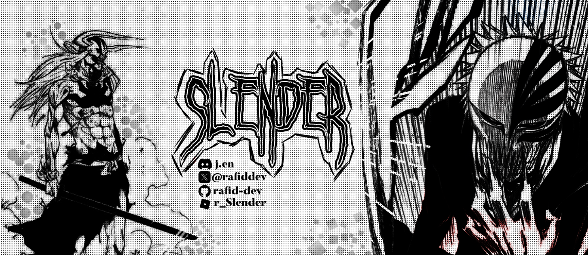

# **Hello there, I'm Rafid Ahsan!** 👋  
## Full-Stack Roblox Scripter | Pure Math Enthusiast**  
🌍 **Location:** Bangladesh  

---

## **🌟 About Me**  
With over **5 years of experience as a full-stack scripter**, I specialize in **frontend VFX and UI scripting** on Roblox, having contributed to projects totaling over **7 billion visits**.  

My primary passion lies in **pure mathematics**, particularly in **analysis, topology, and geometry**, while also exploring their profound connections to **physics**, including **quantum mechanics and general relativity**.  

I am deeply fascinated by **mathematics and deep learning**, emphasizing their **theoretical foundations and practical applications**. My projects range from **developing efficient C++ chess engines** to **simulating N-body dynamics**.  

---

## **🚀 Key Interests**  
- **Pure Mathematics:** Analysis, Topology, Geometry  
- **Theoretical Physics:** Quantum Mechanics, General Relativity  
- **Deep Learning:** Mathematical Foundations and Practical Implementations  
- **Game Development:** Roblox VFX and UI Scripting  
- **GPU Programming:** CUDA for High-Performance Computing  

---

## **📌 Pinned Repositories**  

### **[Rice](https://github.com/rafid-dev/rice)**  
- 🧠 **C++ UCI Chess Engine** - Powerful, efficient, and highly optimized  
- 💡 **Language:** C++  
-    

---

### **[Jet](https://github.com/rafid-dev/jet)**  
- ⚡ **Ultra Fast Chess Engine** - Built for speed and performance  
- 💡 **Language:** C++  
-    

---

---

## **🌐 Get in Touch**  
- **Email:** [vorahsan@gmail.com](mailto:vorahsan@gmail.com)  
- **GitHub:** [github.com/rafid-dev](https://github.com/rafid-dev)  
- **Twitter:** [twitter.com/rafiddev](https://twitter.com/rafiddev)  
- **LinkedIn:** [linkedin.com/in/rafidahsan](https://www.linkedin.com/in/rafidahsan)  
- **Discord:** @j.en  

---

Feel free to explore my projects and reach out if you'd like to **collaborate** or **exchange ideas**. Let's create something extraordinary together!  

---

  

---
